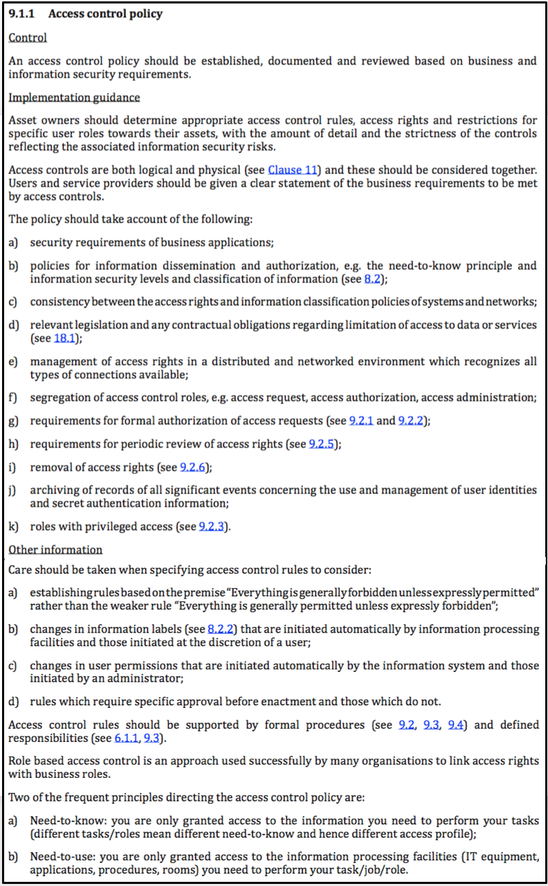

# OSCAL Concepts

This is an explanation of the basic constructs supported by OSCAL. These constructs exist in all OSCAL bindings (e.g., XML, JSON). At this time, the material covers OSCAL controls, catalogs, and profiles. Additional OSCAL constructs will be added as they are developed and mature.

## OSCAL Controls

In OSCAL, a *control* is a safeguard or countermeasure designed to satisfy a set of defined security and/or privacy requirements. The definitions of controls vary greatly from one standard or guideline to another in terms of the level of detail and the types of information the definitions include. A control definition may be as simple as, "The organization has an access control policy and procedures," but most are considerably more complicated. Here's an example of a control from [NIST Special Publication (SP) 800-53 Revision 4](https://doi.org/10.6028/NIST.SP.800-53r4):

This control has seven high-level components, including a security control identifier ("AC-1"), a title ("ACCESS CONTROL POLICY AND PROCEDURES"), the control itself, supplemental guidance, control enhancements, references, and a priority and baseline allocation. Now look at a similar excerpt of [ISO 27002](https://www.iso.org/standard/54533.html) on access control policy. It is even more detailed, with an identifier ("9.1.1"), a title ("Access control policy"), control text, lengthy implementation guidance, and other information (additional advice on access control policy).

Comparing the ISO 27002 and NIST SP 800-53 examples show obvious differences. NIST SP 800-53 includes several components, such as references, control enhancements, and priority, that ISO 27002 does not. NIST SP 800-53's statement of the control itself is also much more detailed and specific than ISO 27002's, because ISO 27002 provides those details in its implementation guidance instead of the control text. There are other differences in terminology as well, such as NIST SP 800-53 using the term "supplemental guidance" for roughly what ISO 27002 calls "other information".

OSCAL is designed to take disparate control definitions from different sources and express them in a standardized way using its control element.

## OSCAL Catalogs

An *OSCAL catalog* is a set of closely related OSCAL controls. The catalog for [NIST Special Publication (SP) 800-53 Revision 4](https://doi.org/10.6028/NIST.SP.800-53r4) defines all NIST SP 800-53 controls. There would be a separate catalog for the controls from [ISO 27002](https://www.iso.org/standard/54533.html). An OSCAL catalog may simply define controls, or it may also organize those controls. *Sections* can be defined to partition a catalog, with each section containing one or more references to controls or control groups. A *group* references related controls or control groups.

## OSCAL Profiles

An *OSCAL profile* is a set of security requirements, where meeting each requirement necessitates implementing one or more security controls. Also called a baseline or overlay, examples of profiles include the control baselines in NIST SP 800-53, the FedRAMP baselines, and the PCI DSS requirements. 

The figure below is an example of what OSCAL is doing with catalogs and profiles. This example represents the NIST SP 800-53 low baseline, which is a profile in OSCAL nomenclature. The profile is effectively indicating which controls from the NIST SP 800-53 catalog are required to be compliant with the profile (NIST SP 800-53 low baseline). Using OSCAL formats for these makes the mappings between the control catalog and the profile explicit and machine readable. A single profile can reference controls in multiple catalogs. OSCAL will allow profiles to be generated using the same interoperable format regardless of which catalogs are being used.

